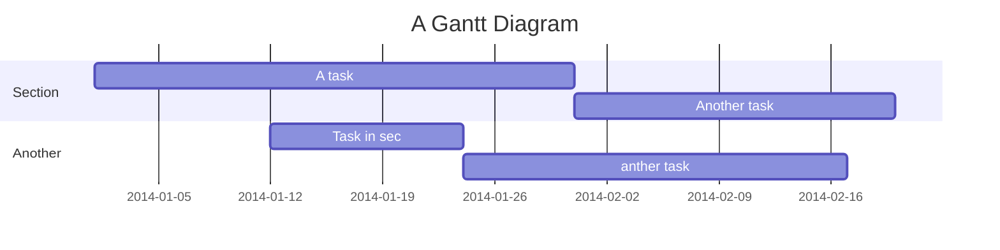

# Transportation Operations
---
交通流(traffic flow, $q$, 单位：vehicle/h)，车辆密度(density, $k$, 单位：vehicle/km)，和 空间平均速度(space mean speed, $v$, 单位：km/h)三者之间的关系为：\begin{equation}q = kv\end{equation}

## Bottleneck Detection
* Q1: 什么是bottleneck？

    A1：**A location that restricts vehicle movement.**
    bottleneck有时会影响traffic flow，有时不会。据此，我们将bottleneck分为**Active Bottleneck**和**Inactive Bottleneck**。
    **Active Bottleneck**：当车辆行驶过当前位置时，会影响车辆移动的bottleneck。
    **Inactive Bottleneck**：当车辆行驶过当前位置时，不会影响车辆移动的bottleneck。也就是说，**在bottleneck处的交通需求（travel demand）小于bottleneck处的通行能力（capacity）**。

在bottleneck处于active状态时，我们就可以测试bottleneck的各种属性。那么：
* Q2：我们如何确定一个bottleneck是否处于active状态？

    A2：通过比较当前交通流与bottleneck处的通行能力的大小：
    1. 如果 $q > c_{bottleneck}$，则bottleneck为active
    2. 如果 $q <= c_{bottleneck}$，则bottleneck为inactive。

    例子：假设现在有如下一条路：
    
    
    * Q3：当交通量较少的时候，如何比较bottleneck上游和下游处的交通流(traffic flow)？
    * A3：**当交通量较少的时候，bottleneck上下游的Density相同；Speed基本相同**。
    * Q4：当交通量较大时，如何比较bottleneck上游和下游处的交通流(traffic flow)？
    * A4：因为bottleneck处于active状态时，bottleneck上游的交通流(traffic flow, $q_{upstream}$)较大，下游的交通流(congested traffic flow, $q_{downstream}$)较小。在车流经过bottleneck时，会有部分车辆挤在bottleneck处，导致bottleneck上游的Density偏大。因此**当交通量较大的时候，bottleneck上游的Density大于下游的Density**；对于Speed来说，根据$q=kv$, $q_{upstream} = q_{downstream}$, 且 $k_{upstream} > k_{downstream}$，所以得到$v_{upstream} < v_{downstream}$。也就是：
    **当交通量较大的时候，bottleneck上游的行车速度小于下游的行车速度**。这个结论在直观上也比较好理解，当车辆通过bottleneck后，由于前方没有限制，车速会提升。


因此，在bottleneck开始active之前，我们希望能查看自由流的状态(free-flow condition)。
但是，一旦bottleneck变为active之后，我们就希望观察bottleneck下游的自由流状态(free-flow condition)和bottleneck上游的拥堵状态或排队情况(congested conditions/queues)。
  
**总结一下，如果想判断一个bottleneck是否为active，需要观察：**
**1. 上游排队情况(Queued/Congested condition upstream)**
**2. 下游自由流(free-flow traffic downstream)**


### Solution to Bottleneck Detection with Noise
**先看一个例子**：

这是一个 Traffic Flow - Time 的曲线，实际的结果是：在6:43这一时刻，Flow开始骤降。但是由于观测数据中的噪声，我们很难用肉眼观测出Flow骤降的具体时间。

一般来说，道路上每隔0.5~2 mile就会有一个探测器，来记录交通数据，如下图：


所以我们提出了下面的方法来解决这一问题，并检测bottleneck：
我们可以用“车辆累计曲线”(Cumulative Count Curves)来描述探测器数据。
这样做有很多好处，可以帮助我们发现bottleneck:
1. 它更容易区分随机波动和实际的随时间变化
2. 让我们使用高分辨率数据(不需要聚合数据)
3. 让我们在时间和空间中追踪自由流和交通拥堵
4. 显示探测器之间的车辆积累，以确定何时和何处存在排队现象

累积曲线在连续检测器位置上的行为在我们开始使用累积曲线来识别瓶颈并度量它们的特性之前，让我们先来看一些在活动瓶颈处可能遇到的不同情况的假设示例。这可以让我们确定可重复的模式，我们可以在我们的探测器数据中寻找。在这些假设的例子中，我们将考虑一对具有以下标记的检测器:


在不同交通状况下，车辆以自由流动方式顺流而下考虑这样一种情况之间的畅通的汽车旅行时$x_0$和$𝑥_1$,如下图所示：


假设左边的状态为state A，右边的状态为state B，中间的黑色虚线为两个状态的分界线。在$t_0$时刻，$x_0$处的状态从$A$变为$B$。在$t_1$时刻，$x_1$处的状态从$A$变为$B$。那么，在右边的$q-k$图中state A, state B所对应的位置为下图：


**Q5：由于两个自由流交通状态的变化，在$x_0$和$x_1$这两个位置的“累计车辆曲线”($N-t$)会如何变化？**
我们来绘制“累计车辆曲线”随时间的变化图($N$为通过道路上某一点$x$的累计车辆数：


（修正：上右图右边的粉线应该是$N(t, x_1)$，表示在位置$x_1$处的$N-t$变化曲线）
左图中，$q_A$为$A$状态下，在$x_0$处的交通流，$q_B$为$B$状态下，在$x_0$处的交通流。
右图中，粉线是$x_1$处，交通流状态的变化。在时间$t_1$之前，交通流为$q_A$；在在时间$t_1$之后，交通流为$q_B$。
（注意：交通流$q$和时间$Δt$的乘积就是某一小段时间$Δt$的车辆数$N$）


## Table of Contents

[TOC]

## Beginners Guide

If you are a total beginner to this, start here!

1. Visit hackmd.io
2. Click "Sign in"
3. Choose a way to sign in
4. Start writing note!

User story
---

```gherkin=
Feature: Guess the word

  # The first example has two steps
  Scenario: Maker starts a game
    When the Maker starts a game
    Then the Maker waits for a Breaker to join

  # The second example has three steps
  Scenario: Breaker joins a game
    Given the Maker has started a game with the word "silky"
    When the Breaker joins the Maker's game
    Then the Breaker must guess a word with 5 characters
```
> I choose a lazy person to do a hard job. Because a lazy person will find an easy way to do it. [name=Bill Gates]


```gherkin=
Feature: Shopping Cart
  As a Shopper
  I want to put items in my shopping cart
  Because I want to manage items before I check out

  Scenario: User adds item to cart
    Given I'm a logged-in User
    When I go to the Item page
    And I click "Add item to cart"
    Then the quantity of items in my cart should go up
    And my subtotal should increment
    And the warehouse inventory should decrement
```

> Read more about Gherkin here: https://docs.cucumber.io/gherkin/reference/

User flows
---
```sequence
Alice->Bob: Hello Bob, how are you?
Note right of Bob: Bob thinks
Bob-->Alice: I am good thanks!
Note left of Alice: Alice responds
Alice->Bob: Where have you been?
```

> Read more about sequence-diagrams here: http://bramp.github.io/js-sequence-diagrams/

Project Timeline
---


> Read more about mermaid here: http://knsv.github.io/mermaid/

## Appendix and FAQ

:::info
**Find this document incomplete?** Leave a comment!
:::

###### tags: `Templates` `Documentation`
